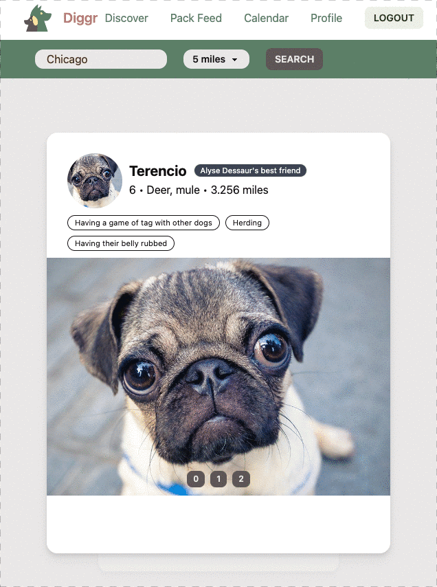

# Facewoof

A place for dog owners to meet the dogs around them: swipe through nearby
profiles, turn matches into a pack, and put a playdate on a shared calendar.

Facewoof started as a team project, and was renamed Diggr partway through the
course. This is the original name restored, along with everything needed to run
and deploy it: a reconstructed schema, real migrations, session authentication,
rate limiting, browser tests and a pipeline to Azure.

**[Try the demo](https://facewoof.abera.tech)** — one click, no sign-up.

<p align="center">
  
</p>

## Running it

Docker is the only thing that needs to be installed. There is no local node,
npm or postgres to set up.

```
make            # list every target
make dev        # database, API and hot reloading client on http://localhost:3000
make seed       # reload schema and seed data into the running database
make reset-db   # throw the database away and rebuild it from scratch
make psql       # a psql shell against the development database
make lint       # eslint and prettier, against your working tree
make fmt        # rewrite files to match prettier
make image      # build the production image the deploy pipeline builds
make run        # build and run the production image on http://localhost:8080
make clean      # stop everything and delete the database volume
```

`make dev` brings up three containers: `db` (postgres 17), `api` (express, in
watch mode) and `web` (the vite dev server). The client and server are bind
mounted, so edits on the host reload in the container.

The database initialises itself from `server/db/sql/` the first time the volume
is created. After that, `make seed` replays the schema and seed, and
`make reset-db` starts over.

## How it fits together

| Piece                      | What it is                                                                        |
| -------------------------- | --------------------------------------------------------------------------------- |
| `src/`                     | the React client, built by vite                                                   |
| `server/routes.js`         | every HTTP route, all under `/api`                                                |
| `server/controllers/`      | request handling: unpack the request, call the database layer, shape the response |
| `server/db/`               | the queries, one module per feature                                               |
| `server/db/sql/schema.sql` | the schema                                                                        |
| `server/db/sql/seed.sql`   | seed data, generated by `generate-seed.py`                                        |

In development the client is served by vite and proxies `/api` to the API
container. In production a single container serves both: express serves the
built bundle and the API on one port, so nothing is cross-origin.

### The database

The original database was never committed — no schema, no migrations, nothing
but the queries that read it. `server/db/sql/schema.sql` is reconstructed from
those queries, so the column names and types are what the application actually
expects.

Eight tables: `users`, `profile_photos`, `friends`, `pending_relationships`,
`packs`, `pack_users`, `playdates`, `posts`.

`seed.sql` is generated, not hand written. It rebuilds from
`server/controllers/users.json`, the fixture the original team left behind, and
adds packs, posts and playdates so every screen has something on it. Regenerate
it with:

```bash
python3 server/db/sql/generate-seed.py
```

It is deterministic: regenerating without changing the generator produces an
identical file.

### Demo accounts

`POST /api/auth/guest` creates a throwaway account cloned from a seeded
template, and the landing page's "Try the demo" button calls it.

Each visitor gets their own account rather than sharing one. Sharing would mean
the first few people to swipe through the seeded profiles emptied the discover
feed for everyone after them, and that whatever one visitor posted to a pack
showed up for the next. Guests are not discoverable, so they never appear in
anyone else's feed either. The server sweeps guests older than
`GUEST_TTL_HOURS` (24 by default) once an hour, and `ON DELETE CASCADE` takes
their photos, swipes, posts and playdates with them.

Guest accounts are not real authentication and the API does not yet enforce who
you are — any `userId` may be passed to any endpoint. That is acceptable for a
demo over seeded data and is the next thing to fix.

## Configuration

Copy `.env.example` to `.env`. Every value has a working default, so `make dev`
needs no `.env` at all.

| Variable                                | What it does                                                                                              |
| --------------------------------------- | --------------------------------------------------------------------------------------------------------- |
| `DATABASE_URL`                          | the database. Set by compose locally; the only one that matters in production                             |
| `PGHOST` etc.                           | used instead of `DATABASE_URL` when it is not set                                                         |
| `PGSSL`                                 | `true` for Azure Database for PostgreSQL, which requires TLS                                              |
| `PORT`                                  | what the server listens on (8080 in the production image)                                                 |
| `BASE_PATH`                             | mount the whole app under a path, e.g. `/facewoof`                                                        |
| `GUEST_TTL_HOURS`                       | how long a demo account lives                                                                             |
| `CORS_ORIGIN`                           | comma separated. Unset means no cross-origin requests are allowed                                         |
| `VITE_BASE_PATH`                        | build time. Must match `BASE_PATH`                                                                        |
| `VITE_CLOUD_NAME`, `VITE_UPLOAD_PRESET` | Cloudinary, for photo uploads. Optional: without them the upload widget says so and everything else works |
| `ENTRA_ISSUER` etc.                     | sign-in through Entra External ID. Optional: see below                                                    |

### Sign-in

Anyone can use Facewoof through a demo account without signing in, and that is
the default. Configuring the four variables below adds Google and Microsoft
sign-in on top; with any of them missing the buttons do not appear and nothing
else changes.

| Variable              | What it does                                                            |
| --------------------- | ----------------------------------------------------------------------- |
| `ENTRA_ISSUER`        | `https://<tenant>.ciamlogin.com/<tenant-id>/v2.0`                       |
| `ENTRA_CLIENT_ID`     | the app registration's application (client) ID                          |
| `ENTRA_CLIENT_SECRET` | a client secret from that registration                                  |
| `ENTRA_REDIRECT_URI`  | `https://<host>/api/auth/oidc/callback`, registered as a redirect URI   |
| `ENTRA_PROVIDERS`     | which sign-in buttons to show, e.g. `email,google`. Defaults to `email` |

Entra External ID is the front door, and the social providers are configured
inside that tenant. The app talks OIDC to one issuer and never holds Google's
credentials itself, so adding a provider is a change in the tenant plus one
name in `ENTRA_PROVIDERS`, rather than a change to this code.

`ENTRA_PROVIDERS` exists so the page only ever offers what the tenant can
actually do. Email needs no federation and works as soon as a tenant exists;
`google`, `facebook` and `apple` each need setting up at the provider first,
and listing one before that is done gives you a button that dead-ends.

Note that a personal Microsoft account is **not** one of External ID's
providers — it federates Facebook, Google, Apple, custom OIDC and SAML. An
organisation's own Entra tenant can be added as a custom OIDC provider, but
that is organisational sign-in, not consumer "sign in with Microsoft".

To set it up: create an External ID tenant, register an application with the
redirect URI above, create a sign-up and sign-in user flow and attach the app
to it. That alone gives you email sign-in. For Google, add it as an identity
provider and add it to the same user flow. The
[Microsoft walkthrough](https://learn.microsoft.com/entra/external-id/customers/how-to-google-federation-customers)
covers the Google side.

Signing in from a demo account claims that account rather than making a second
one, so the swipes, packs and playdates from the demo are kept and the account
stops being swept up by the guest cleanup.

The sign-in flow is covered by tests that run against a mock provider in
`tests/oidc-mock`, so no Azure credentials are needed to work on it:

```bash
make e2e-signin
```

## Deploying

Facewoof runs on Azure Container Apps at
[facewoof.abera.tech](https://facewoof.abera.tech), deployed by
`.github/workflows/deploy.yml` on every push to `main` whose checks pass. The
one-time Azure and DNS setup is in [docs/DEPLOY.md](docs/DEPLOY.md).

The production image serves the client and the API on port 8080 and runs as a
non-root user. `/healthz` checks the database and is what the platform polls.
Migrations run at start-up behind an advisory lock, so several replicas
starting at once on a deploy is safe.

At the root of its own host:

```bash
docker build --target final -t facewoof .
docker run -p 8080:8080 -e DATABASE_URL=... facewoof
```

Under a path on another host, e.g. `abera.tech/facewoof`. The prefix has to be
baked into the client bundle, because vite rewrites asset URLs at build time:

```bash
docker build --target final --build-arg VITE_BASE_PATH=/facewoof/ -t facewoof .
docker run -p 8080:8080 -e DATABASE_URL=... -e BASE_PATH=/facewoof facewoof
```

`BASE_PATH` is only needed when the reverse proxy forwards the prefix
untouched. If it strips the prefix before forwarding, leave `BASE_PATH` unset
and build with `VITE_BASE_PATH` alone.

## What the revival changed

The app had not been run in some time and did not start. The larger items:

- **The client could not build.** Two components called `require('dotenv')` and
  used `__dirname` in browser code, and read `process.env.VITE_*`, which vite
  does not substitute. They use `import.meta.env` now.
- **There was no database and no schema.** Both are reconstructed above.
- **There was no authentication.** Okta had been removed in the last three
  commits and nothing replaced it: the login page fired a request for one
  hard coded account from its render body, so it looped forever and signed
  everyone in as the same person.
- **Every query was built by string interpolation**, so the API was injectable
  through any parameter. All of them are parameterised.
- **Two paid API keys were required to start**: zipcodeapi.com for the radius
  search and Google Geocoding for the location box. The `zipcodes` package
  carries the US zip code table locally and answers both offline.
- **The API hard coded `http://localhost:3001`** in six components, so a build
  only ever talked to a developer's own machine. Requests are relative now.
- Dependencies were about three years stale. React Router moved 5 → 7, vite
  4 → 6, express 4 → 5, and tailwind is a real build step rather than the CDN
  script, which is not meant for production.

Smaller fixes are noted in comments where they were made, next to the code that
had the problem.
